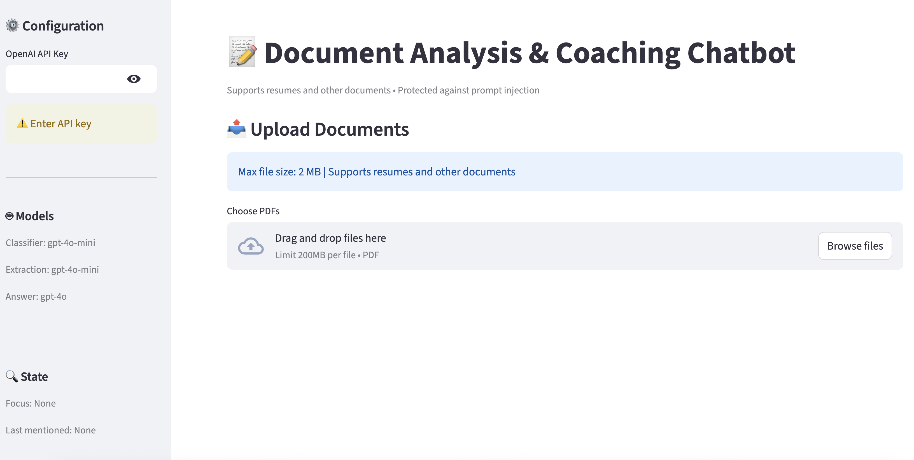
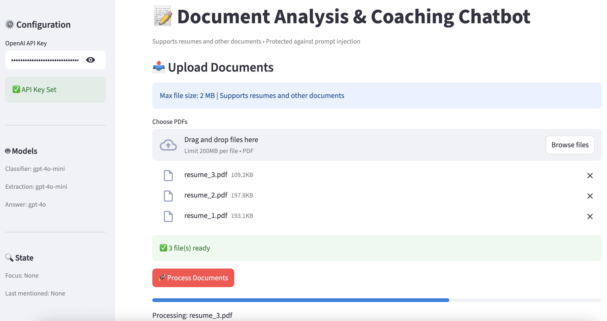
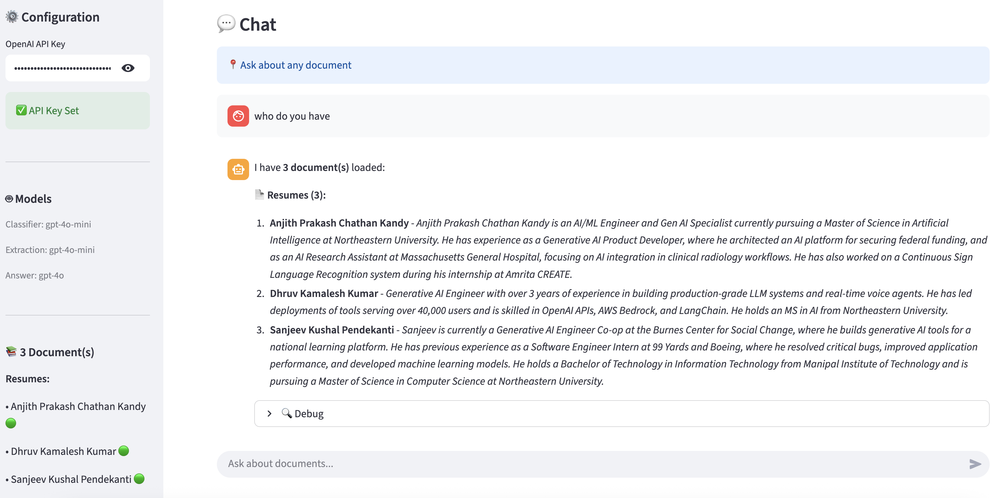

# Persona Chatbot — Recruiter-Facing AI Agent

A RAG-powered chatbot that **speaks as you** to recruiters. Upload your resume and supporting documents, configure a persona, and let the agent answer questions in first person — grounded in your real experience, with access to live tools like web search, GitHub, and LinkedIn.

---

## Screenshots

### Home Screen


### Resume Upload


### AI Response Example


---

## Overview

Traditional resume chatbots answer *about* candidates. This one answers *as* you.

The system loads a `persona.yaml` file that defines your identity, tone, and speaking style, then processes your uploaded PDFs (resumes, cover letters, transcripts) through a security-hardened pipeline. When a recruiter asks a question, an **agent loop** decides which tools to call — semantic search over your documents, GitHub repo lookup, LinkedIn profile search, general web search, or even a weather check — then synthesizes a natural, first-person response.

**Key ideas:**
- **Single-tenant persona** — one identity per deployment, configured via YAML
- **Agentic tool use** — the LLM decides which tools to call and when, across multiple rounds
- **Memory** — short-term conversation context and long-term extracted facts persist across turns
- **Security-first document processing** — multi-layer prompt injection detection and sanitization

---

## Features

### Persona System
- YAML-based identity configuration (name, role, location, tone, speaking style, bio, contact links)
- System prompt built dynamically from persona + loaded documents
- First-person responses grounded in your actual documents

### Agent Loop with Tool Calling
The chatbot uses an iterative agent loop (up to 6 tool-call rounds per message) with five tools:

| Tool | Source | Purpose |
|------|--------|---------|
| `semantic_search` | FAISS vector DB | Search your uploaded documents by meaning |
| `web_search` | DuckDuckGo | Look up companies, roles, industry news |
| `github_search` | GitHub REST API | Search your repos, profile, and contributions |
| `linkedin_search` | Web scraping + search | Look up your LinkedIn profile and activity |
| `weather_lookup` | wttr.in | Small-talk and logistics ("weather in Boston?") |

The agent decides autonomously which tools to invoke based on the recruiter's question. Tool dispatch auto-injects context (vector DB references, GitHub username, LinkedIn URL) from session state and persona config.

### Memory System
- **Short-term memory** — rolling window of recent conversation turns with overflow summarization
- **User facts memory** — structured store of profile info, skills, roles, organizations, and key facts extracted from documents and persona config
- Both are injected into every agent prompt for conversational continuity

### Document Processing Pipeline
- **PDF upload** with file size validation (2 MB limit) and duplicate detection (file hash, content fingerprint, name matching)
- **Prompt injection sanitization** — zero-width character removal, whitespace encoding detection, Unicode smuggling neutralization, NFKC normalization, injection phrase flagging
- **LLM-based classification** — dedicated model call classifies each document as resume vs. non-resume before extraction
- **Structured extraction** — resumes get work/education history with parsed dates; other documents get key entities, facts, and summaries
- **FAISS vector index** built from document chunks for semantic search

### Security Guardrails

| Layer | Technique |
|-------|-----------|
| 1 | Zero-width character removal (20+ Unicode chars) |
| 2 | Whitespace encoding detection |
| 3 | Unicode smuggling neutralization (tag chars, PUA, orphan selectors) |
| 4 | NFKC normalization (homoglyph defense) |
| 5 | Injection phrase detection (instruction overrides, ranking manipulation, role hijacking) |
| 6 | Guarded LLM prompts on all extraction and answer calls |

Risk scores are calculated per document and displayed in the UI:
- 🟢 0.0–0.2: Low risk
- 🟡 0.2–0.5: Medium risk (warning shown)
- 🔴 0.5–1.0: High risk (flagged)

---

## Tech Stack

| Component | Technology |
|-----------|------------|
| **Frontend** | Streamlit |
| **LLM** | OpenAI GPT-4o / GPT-4o-mini |
| **Vector DB** | FAISS (in-memory) |
| **Embeddings** | SentenceTransformers (`all-MiniLM-L6-v2`) |
| **PDF extraction** | pypdf |
| **Web search** | DuckDuckGo (`ddgs` library) |
| **Persona config** | YAML (`pyyaml`) |
| **Environment** | python-dotenv |

### Model Roles

| Role | Model | Used For |
|------|-------|----------|
| Classifier | `gpt-4o-mini` | Document type classification |
| Extractor | `gpt-4o-mini` | Structured data extraction from documents |
| Agent / Answerer | `gpt-4o` | Agent loop reasoning, tool calls, and final answers |
| Chat | `gpt-4o-mini` | Follow-up question suggestions |

---

## Installation

### Prerequisites
- Python 3.8+
- An OpenAI API key

### Setup

1. **Clone the repository**
   ```bash
   git clone https://github.com/batuhanisik751/RagChatbotTestV2.git
   cd RagChatbotTestV2
   ```

2. **Create and activate a virtual environment**
   ```bash
   python -m venv venv
   source venv/bin/activate  # Windows: venv\Scripts\activate
   ```

3. **Install dependencies**
   ```bash
   pip install -r requirements.txt
   ```

4. **Configure environment variables**
   ```bash
   cp .env.example .env
   ```
   Open `.env` and add your OpenAI API key:
   ```
   OPENAI_API_KEY=sk-...
   ```
   Optionally add a GitHub token to raise the API rate limit from 60 to 5 000 requests/hour:
   ```
   GITHUB_TOKEN=ghp_...
   ```

5. **Configure your persona**
   ```bash
   cp persona.example.yaml persona.yaml
   ```
   Edit `persona.yaml` with your name, role, bio, tone, and contact links. The `github` and `linkedin` fields are used by the agent tools automatically.

6. **Run the app**
   ```bash
   streamlit run chatbot.py
   ```
   Open `http://localhost:8501` in your browser.

---

## Usage

### 1. Upload Documents
- Upload one or more PDFs (resume, cover letter, transcript, etc.)
- Each file is validated for size, checked for duplicates, sanitized, classified, and indexed
- Click **Process Documents** to run the full pipeline

### 2. Chat
- Ask anything a recruiter would: background, skills, projects, timeline questions
- The agent decides which tools to call, retrieves information, and responds in first person as your persona
- Follow-up suggestions appear after each answer
- Debug info is available via the expandable panel on each message

### Example Questions
- "Tell me about your background"
- "What projects have you worked on?"
- "What were you doing in 2024?"
- "Show me your GitHub work"
- "What's on your LinkedIn?"
- "What's the weather in Boston?" (small-talk)

---

## Project Structure

```
RagChatbotTestV2/
├── chatbot.py                  # Main Streamlit app (UI, orchestration)
├── persona.yaml                # Your persona config (git-ignored)
├── persona.example.yaml        # Template for persona.yaml
├── .env                        # API keys (git-ignored)
├── .env.example                # Template for .env
├── requirements.txt            # Python dependencies
├── LICENSE                     # MIT License
├── README.md
└── modules/
    ├── agent.py                # Agent loop: reason → tool-call → synthesize
    ├── tools.py                # 5 tools + OpenAI function-calling schemas
    ├── config.py               # Model names, file size limits, paths
    ├── models.py               # Data classes (FileType, ClassificationResult, InjectionReport)
    ├── persona.py              # YAML persona loader + system prompt builder
    ├── prompts.py              # Guarded extraction & answer prompts
    ├── memory.py               # Short-term + user-facts memory layers
    ├── session_state.py        # Streamlit session state defaults & reset
    ├── answers.py              # Persona answer generation + suggestion engine
    ├── document_processing.py  # Full document pipeline (extract → sanitize → classify → index)
    ├── text_processing.py      # Text cleaning, chunking, FAISS index building
    ├── extraction.py           # LLM-based structured data extraction
    ├── classifier.py           # LLM-based document type classification
    ├── injection_guard.py      # Multi-layer prompt injection detection & sanitization
    ├── query_analysis.py       # Query date extraction
    ├── date_utils.py           # Date parsing and filtering
    ├── file_utils.py           # File size checks + duplicate detection
    └── utils.py                # Display name helpers
```

---

## Configuration

### Persona (`persona.yaml`)

| Field | Required | Description |
|-------|----------|-------------|
| `name` | Yes | Your full name |
| `role` | Yes | Your current role / title |
| `location` | No | Where you're based |
| `tone` | No | How the bot should sound (defaults to "Professional yet friendly") |
| `speaking_style` | No | First-person style guidance |
| `bio` | No | A paragraph about yourself |
| `contact.email` | No | Email address |
| `contact.linkedin` | No | LinkedIn profile URL (used by `linkedin_search` tool) |
| `contact.github` | No | GitHub profile URL (used by `github_search` tool) |
| `contact.website` | No | Personal website |

### Models (`modules/config.py`)

| Constant | Default | Purpose |
|----------|---------|---------|
| `CLASSIFIER_MODEL` | `gpt-4o-mini` | Document type classification |
| `EXTRACTION_MODEL` | `gpt-4o-mini` | Structured data extraction |
| `ANSWER_MODEL` | `gpt-4o` | Agent loop + answer generation |
| `CHAT_MODEL` | `gpt-4o-mini` | Follow-up suggestions |

### Limits

| Setting | Default |
|---------|---------|
| `MAX_FILE_SIZE_MB` | 2 |
| `MAX_TOOL_ROUNDS` | 6 (agent loop cap) |

---

## Architecture

```
Recruiter message
       │
       ▼
┌──────────────────────────────────────────────────────────┐
│                      AGENT LOOP                          │
│  Model: gpt-4o  ·  Up to 6 tool-call rounds             │
│                                                          │
│  Inputs:                                                 │
│    • System prompt (persona identity + document summaries│
│      + agent behaviour instructions)                     │
│    • Short-term memory (recent turns + summaries)        │
│    • User-facts memory (profile, skills, roles, facts)   │
│    • Recruiter question                                  │
│                                                          │
│  Each round:                                             │
│    1. LLM decides: reply directly or call tool(s)        │
│    2. If tool calls → execute, append results, loop      │
│    3. If plain text → return as final persona answer     │
└────────────┬─────────────────────────────────────────────┘
             │
    ┌────────┼────────┬────────────┬──────────────┐
    ▼        ▼        ▼            ▼              ▼
semantic  web      github      linkedin       weather
_search   _search  _search     _search        _lookup
 (FAISS)  (DDG)    (REST API)  (scrape+DDG)   (wttr.in)
             │
             ▼
   First-person answer
   returned to recruiter
```

### Document Upload Pipeline

```
PDF upload
    │
    ▼
┌─────────────────────┐
│  Size + dup check   │
└────────┬────────────┘
         ▼
┌─────────────────────┐
│  Raw text extraction │  (pypdf)
└────────┬────────────┘
         ▼
┌──────────────────────────────────────────────┐
│           SANITIZATION LAYER                 │
│  • Zero-width char removal                   │
│  • Whitespace encoding detection             │
│  • Unicode smuggling neutralization          │
│  • NFKC normalization                        │
│  • Injection phrase flagging                 │
│  → InjectionReport with risk score           │
└────────┬─────────────────────────────────────┘
         ▼
┌──────────────────────────────────────────────┐
│     CLASSIFICATION  (gpt-4o-mini)            │
│  Input: first 2 000 chars                    │
│  Output: resume / non_resume + confidence    │
└────────┬─────────────────────────────────────┘
         ▼
┌──────────────────────────────────────────────┐
│  GUARDED EXTRACTION  (gpt-4o-mini)           │
│  Resume → work history, education, skills    │
│  Other  → entities, facts, summary           │
└────────┬─────────────────────────────────────┘
         ▼
┌──────────────────────────────────────────────┐
│  CHUNKING + FAISS INDEX                      │
│  SentenceTransformers (all-MiniLM-L6-v2)     │
└──────────────────────────────────────────────┘
```

---

## Known Limitations

- **PDF only** — no Word, plain text, or image-based file support
- **No OCR** — scanned PDFs without a text layer won't work
- **2 MB file limit** — large or image-heavy PDFs may be rejected
- **In-memory storage** — the FAISS index and all state reset on app restart
- **English-optimized** — document extraction and prompts target English text
- **API rate limits** — subject to OpenAI and GitHub rate limits (set `GITHUB_TOKEN` to raise the GitHub cap)
- **LinkedIn scraping** — public profile scraping may be blocked; falls back to web search

---

## License

[MIT](LICENSE)

---

## Acknowledgments

- [Streamlit](https://streamlit.io/) — web framework
- [OpenAI](https://openai.com/) — language models
- [FAISS](https://github.com/facebookresearch/faiss) — vector search
- [SentenceTransformers](https://www.sbert.net/) — embeddings
- [DuckDuckGo](https://duckduckgo.com/) — web search (via `ddgs`)
- [wttr.in](https://wttr.in/) — weather data
